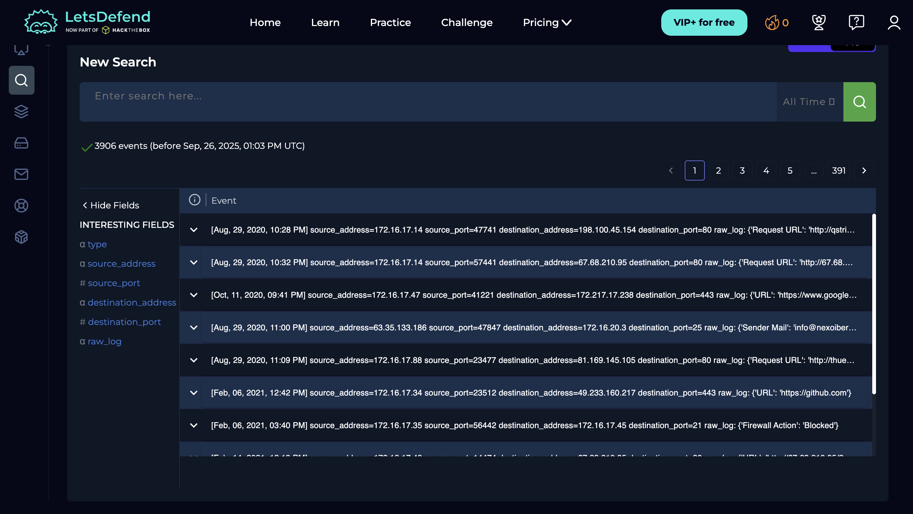
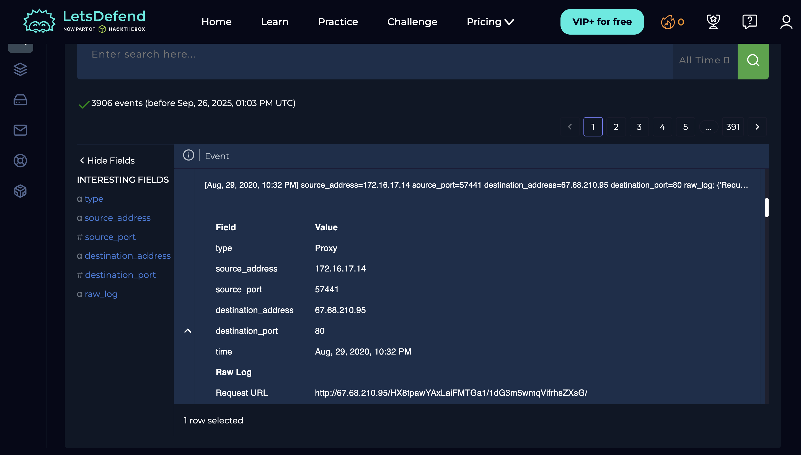
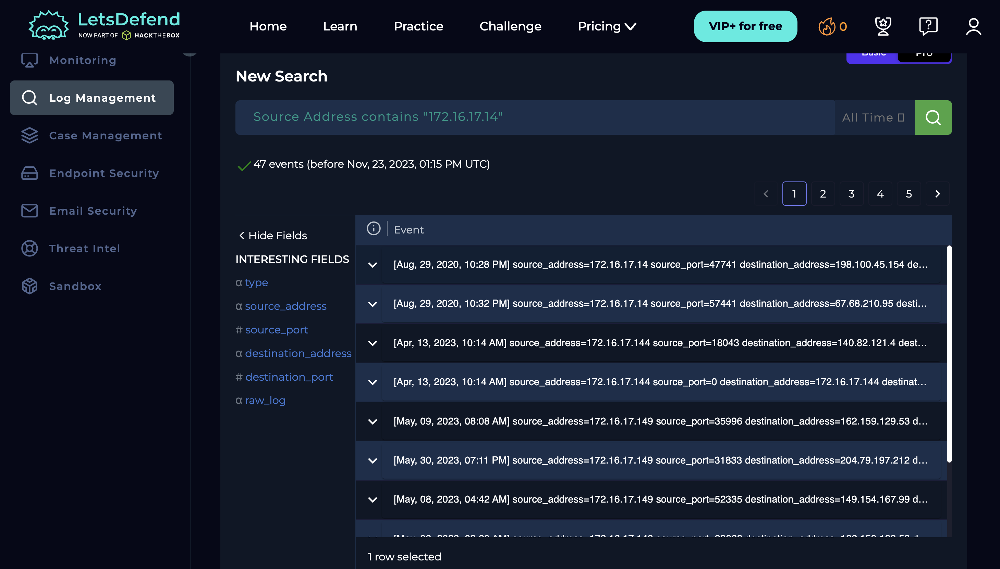
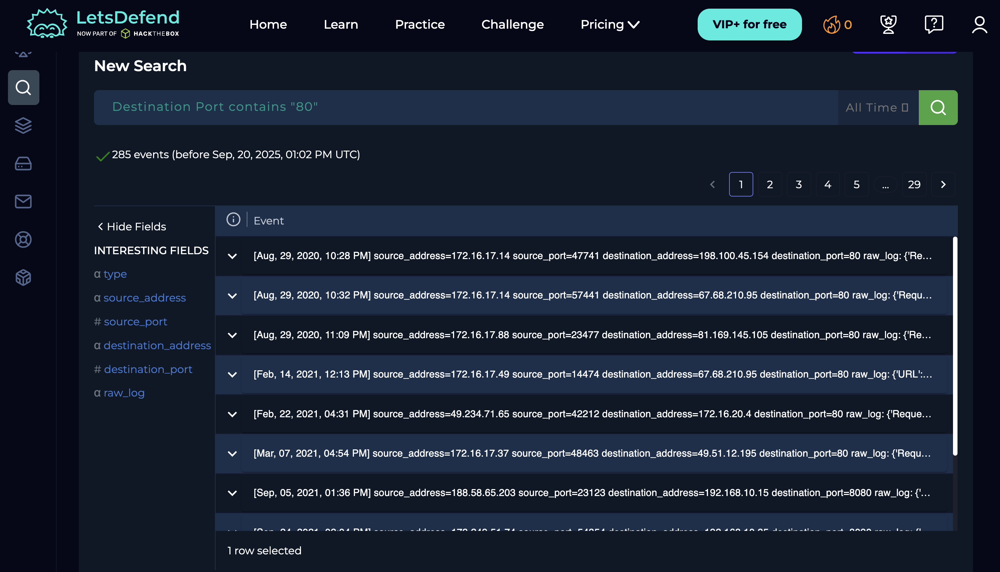
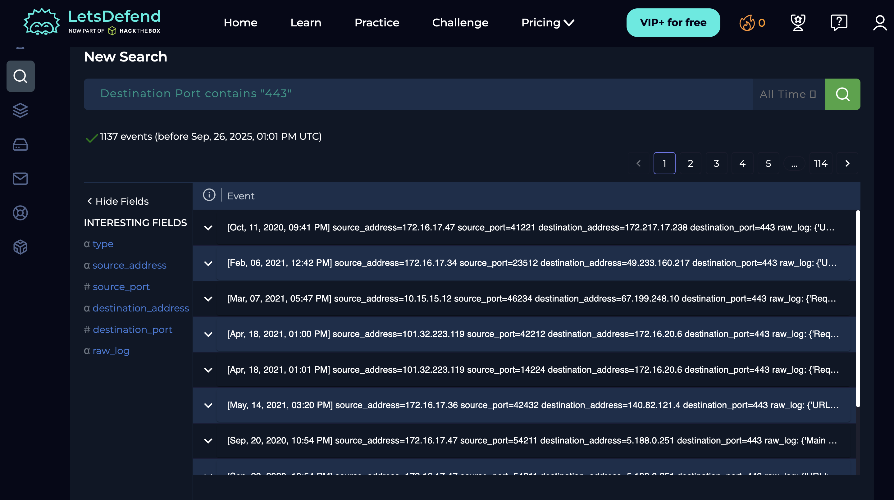
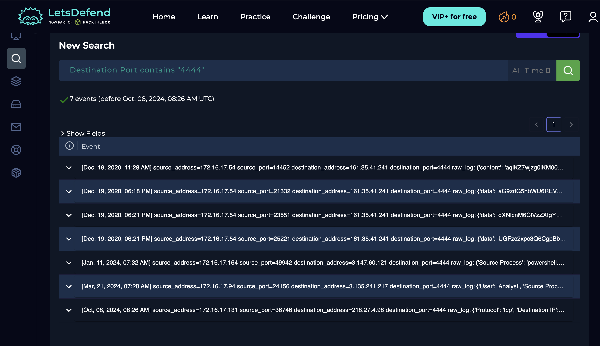
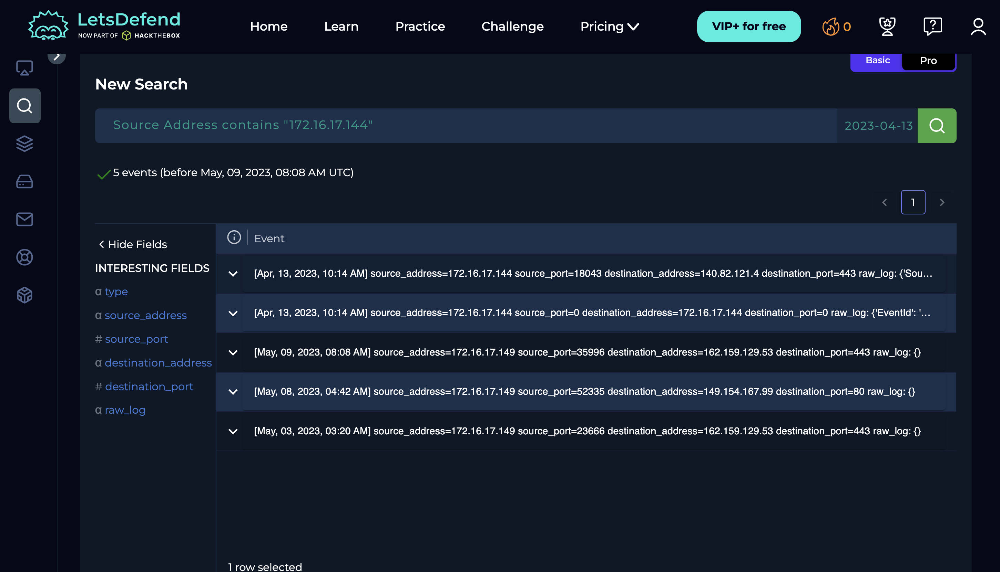
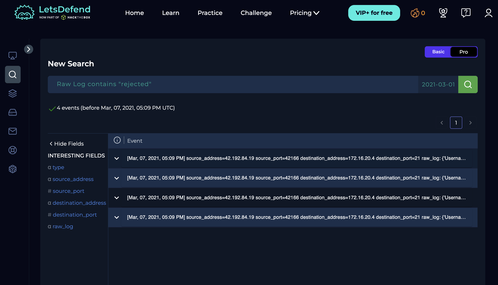

# Log Management
**Platform:** LetsDefend | **Date:** April 2026

## What is Log Management
Log management is the process of collecting, storing, and searching log data 
from different sources to detect suspicious activity.

## Fields Available in LetsDefend
| Field | What it means |
|-------|--------------|
| `type` | Type of log event |
| `source_address` | IP address where traffic originated |
| `source_port` | Port used by the source |
| `destination_address` | IP address receiving the traffic |
| `destination_port` | Port being contacted |
| `raw_log` | Original unprocessed log line |

## Searches I Ran

### 1. Default overview — all 3906 events
No filter applied. Shows total log volume.

*Full log dashboard showing 3906 events across all sources*

### 2. Single expanded log entry

*Expanded view showing all parsed fields for one event*

### 3. Filter by source IP 172.16.17.14
`source_address: "172.16.17.14"`

*This IP appeared multiple times in the default view — filtering isolates all its activity*

### 4. HTTP traffic — destination port 80
`destination_port: "80"`

*Filtering unencrypted HTTP traffic — useful for detecting plain-text C2 or data exfiltration*

### 5. HTTPS traffic — destination port 443
`destination_port: "443"`

*Filtering encrypted HTTPS traffic — comparing volume with port 80 reveals encryption patterns*

### 6. Suspicious port 4444
`destination_port: "4444"`

*Port 4444 is the default Metasploit listener — zero results here is a negative finding worth documenting*

### 7. Source IP with time range applied
`source_address: "172.16.17.14"` + time filter

*Time-scoping an investigation — essential for pinpointing when suspicious activity started*

### 8. Raw log field

*The raw_log field shows the original log line before parsing — SIEM tools structure this into searchable fields*

### 9. Field value breakdown

*Clicking source_address in the left panel shows which IPs appear most — quick way to spot outliers*

## Key Takeaways
- Log filtering by IP and port is the first step in any SOC investigation
- Time-scoping narrows down exactly when an incident occurred
- Raw logs contain the original data — parsed fields make it searchable
- High-frequency IPs are the first thing to investigate
