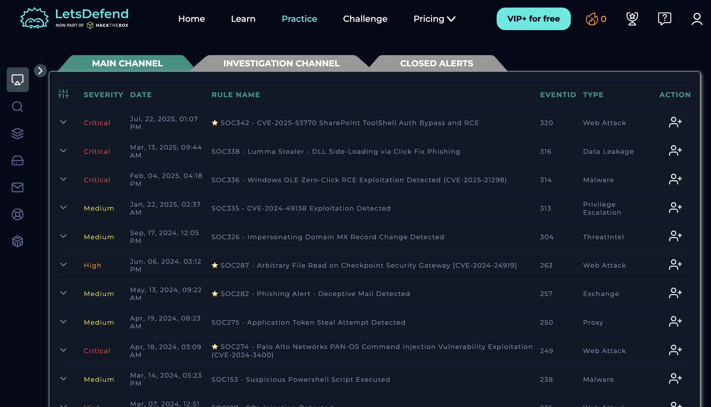
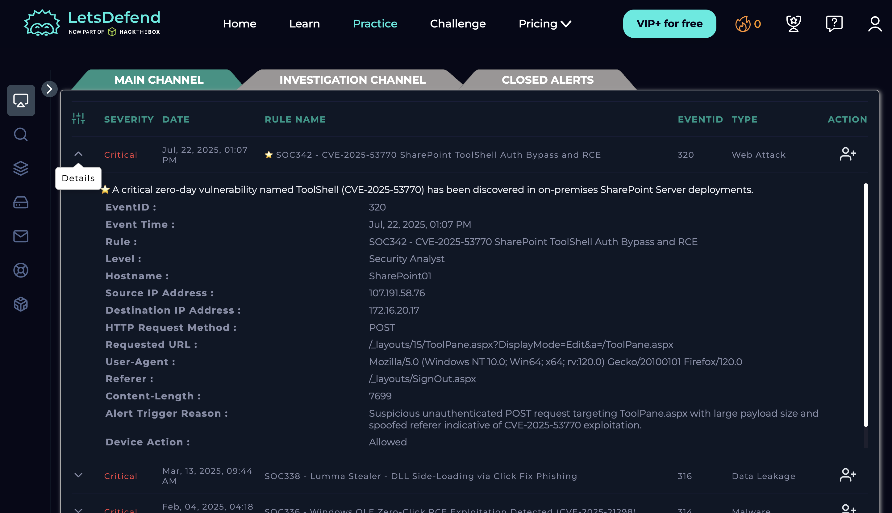
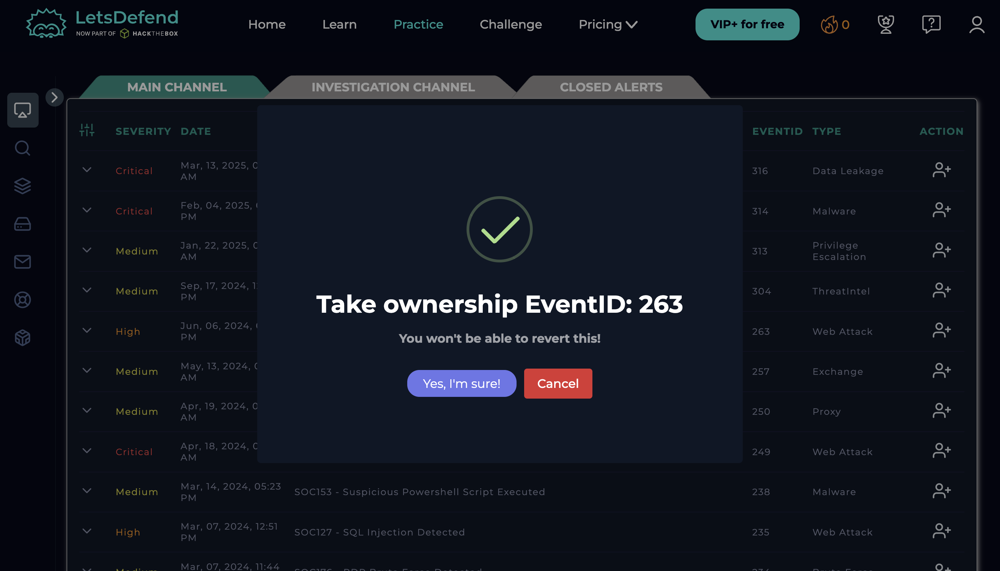
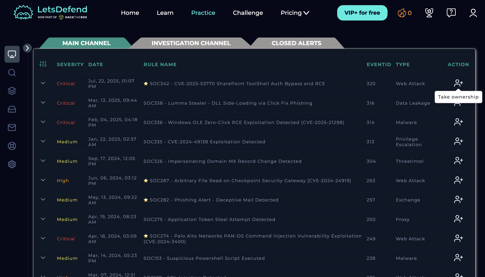
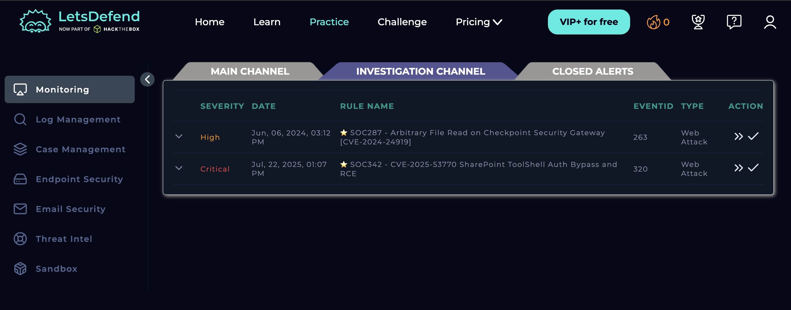
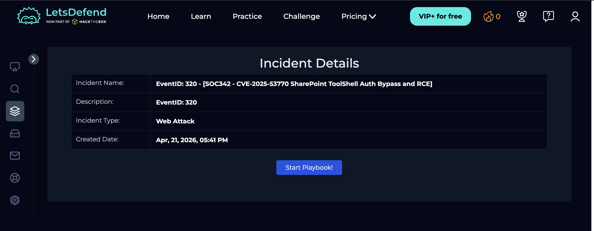
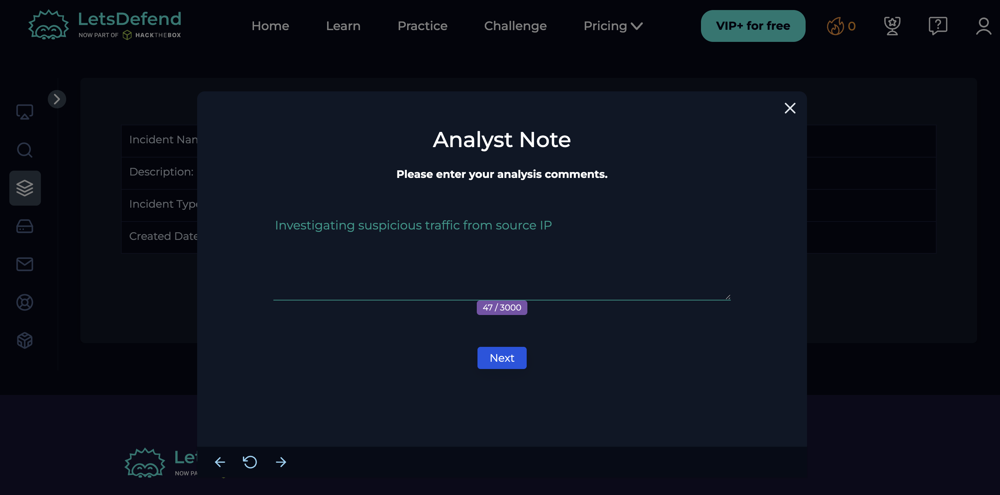
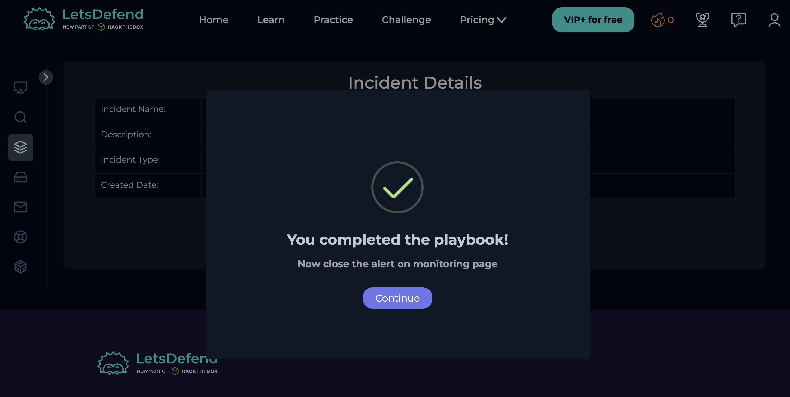

# Case Management
**Platform:** LetsDefend | **Date:** April 2026

## What is Case Management
Case management is the process of tracking, investigating, and resolving 
security alerts. A SOC analyst takes ownership of an alert, investigates 
it, documents findings, and closes the case with a verdict.

## Case Management Workflow
| Step | Action |
|------|--------|
| 1 | Alert triggered in Monitoring |
| 2 | Analyst takes ownership |
| 3 | Case created and investigated |
| 4 | Evidence documented |
| 5 | Verdict: True Positive or False Positive |
| 6 | Case closed with notes |

## Investigation I Performed

### 1. Alert list in Monitoring

*Monitoring dashboard showing active alerts with severity levels — 
first place a SOC analyst checks*

### 2. Alert detail view

*Full alert details showing source IP, destination, time, and rule 
that triggered — this is what you investigate*

### 3. Taking ownership

*Taking ownership of an alert assigns it to you — standard SOC 
triage process before investigation begins*

### 4. Case created

*Case appears in Case Management after creation — shows case ID, 
status, and assigned analyst*

### 5. Case detail view

*Inside the case — timeline of events, evidence collected, and 
investigation notes*

### 6. Analyst notes added

*Documenting investigation findings inside the case — critical habit 
in real SOC work for handover and audit trail*

### 7. Case closed

*Case closed with verdict — every alert must be resolved and 
documented, not just dismissed*

## Key Takeaways
- Every alert needs ownership before investigation can begin
- True Positive = real attack, escalate or remediate
- False Positive = benign activity, close with explanation
- Documentation inside the case is as important as the investigation itself
- Case management creates an audit trail for every security event
