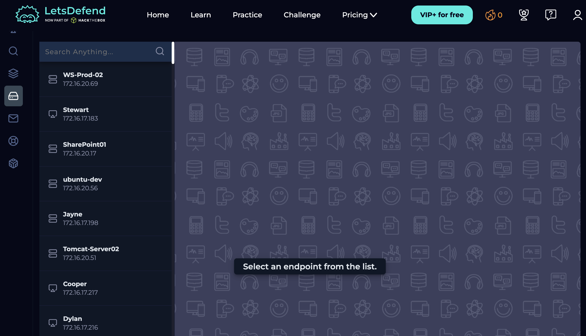
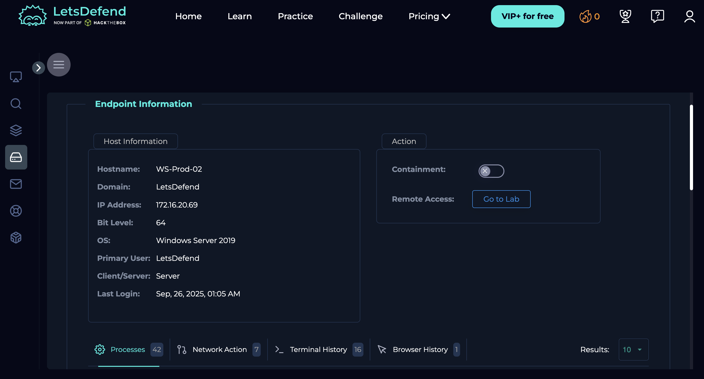
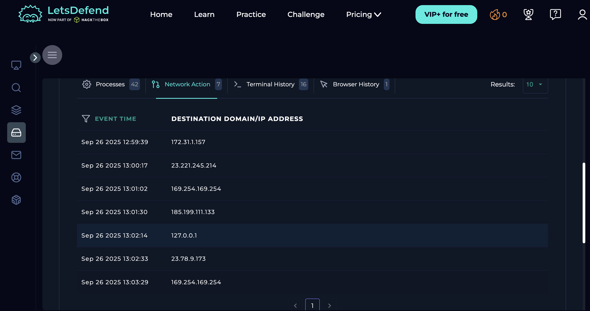
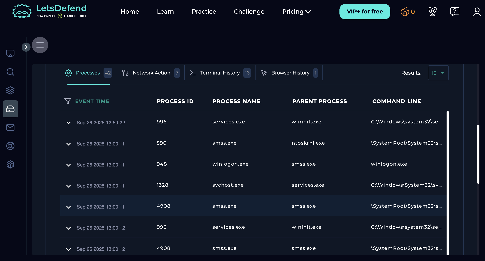
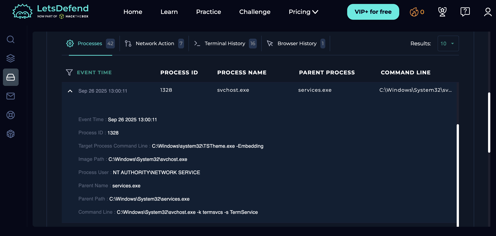

# Endpoint Security
**Platform:** LetsDefend | **Date:** April 2026

## What is Endpoint Security
Endpoint security involves monitoring individual devices (workstations, 
servers) for signs of compromise — suspicious processes, unusual network 
connections, or unauthorized file changes. In a SOC, endpoint investigation 
is triggered when an alert is raised against a specific host.

## Endpoints Available in LetsDefend
| Hostname | IP Address | Type |
|----------|------------|------|
| WS-Prod-02 | 172.16.20.69 | Workstation |
| Stewart | 172.16.17.183 | Workstation |
| SharePoint01 | 172.16.20.17 | Server |
| ubuntu-dev | 172.16.20.56 | Linux Dev Server |
| Jayne | 172.16.17.198 | Workstation |
| Tomcat-Server02 | 172.16.20.51 | Server |
| Cooper | 172.16.17.217 | Workstation |

## Investigation Performed

### 1. Endpoint list overview

*Full list of monitored endpoints showing hostnames and IP addresses. 
This is the starting point when investigating a host-based alert — 
identify the machine first, then drill into its activity.*

### 2. Endpoint detail overview

*Detailed view of the selected endpoint showing OS, status, and last 
seen time. First thing to confirm: is the machine online? When was it 
last active?*

### 3. Network connections — Network Action tab (7 connections)

*7 network connections recorded with timestamps and destination IPs:*

| Destination IP | Notes |
|----------------|-------|
| 172.31.1.157 | Internal IP — normal |
| 23.221.245.214 | External IP — needs investigation |
| 169.254.169.254 | AWS metadata endpoint — suspicious if not a cloud host |
| 185.199.111.133 | GitHub CDN — likely normal |
| 127.0.0.1 | Localhost — normal |
| 23.78.9.173 | External IP — needs investigation |

*169.254.169.254 is the AWS instance metadata endpoint. Connections 
to this IP from a non-cloud workstation is a red flag — could indicate 
SSRF or cloud credential theft attempt.*

### 4. Process list — 42 processes running

*42 processes captured. Analysing parent-child relationships:*

| Process | PID | Parent | Status |
|---------|-----|--------|--------|
| services.exe | 996 | wininit.exe |  Normal |
| smss.exe | 596 | ntoskrnl.exe |  Normal |
| winlogon.exe | 948 | smss.exe |  Normal |
| svchost.exe | 1328 | services.exe |  Normal |
| smss.exe | 4908 | smss.exe |  Unusual — smss spawning smss |

*smss.exe (PID 4908) has smss.exe as its parent process — this is 
abnormal. In a real investigation this would be escalated. Malware 
commonly masquerades as legitimate Windows process names.*

### 5. Suspicious process — expanded view (svchost.exe PID 1328)

*Expanded detail of svchost.exe (PID 1328):*

| Field | Value | Analysis |
|-------|-------|----------|
| Process ID | 1328 | — |
| Process Name | svchost.exe | Common Windows process |
| Parent Process | services.exe |  Correct parent |
| Parent Path | C:\Windows\System32\services.exe |  Legitimate path |
| Image Path | C:\Windows\System32\svchost.exe |  Correct location |
| Process User | NT AUTHORITY\NETWORK SERVICE |  Expected user |
| Command Line | svchost.exe -k termsvcs -s TermService |  Legitimate — Terminal Services |
| Target Process | C:\Windows\system32\TSTheme.exe -Embedding |  Theme service for RDP |

**Verdict: Legitimate process **

*This svchost.exe instance is running Terminal Services (TermService) — 
a standard Windows service. All indicators are clean:*
- *Running from correct path C:\Windows\System32*
- *Parent is services.exe as expected*
- *Running as NT AUTHORITY\NETWORK SERVICE — correct for this service*
- *Command line -k termsvcs -s TermService is a known legitimate flag*

*In a real SOC investigation, a malicious svchost.exe would show: wrong 
parent process (e.g. cmd.exe or explorer.exe), path outside System32 
(e.g. AppData or Temp), or an unusual command line with encoded strings.*

### 6. Terminal history — 16 commands recorded

*16 terminal commands recorded. Commands like whoami, net user, 
ipconfig, or tasklist in terminal history indicate reconnaissance 
activity — an attacker mapping the environment after initial access.*

## What to Look For in a Real SOC

| Indicator | Why It Matters |
|-----------|---------------|
| Process running from AppData or Temp | Malware commonly drops here |
| svchost.exe with non-services.exe parent | Classic malware masquerading |
| Outbound connections to port 4444 or 1337 | Default C2 ports |
| 169.254.169.254 connections from workstation | Possible SSRF or cloud attack |
| whoami / net user in terminal history | Post-exploitation reconnaissance |
| smss.exe spawning smss.exe | Abnormal parent-child relationship |

## Key Takeaways
- Process parent-child relationships reveal whether a process is 
  legitimate or suspicious
- Network connections from an endpoint show where data might be going
- Terminal history is one of the most valuable artifacts in an 
  endpoint investigation
- Legitimate Windows system processes always run from C:\Windows\System32
- Any mismatch between process name and path is an immediate red flag
