# Email Security
**Platform:** LetsDefend | **Date:** April 2026

## What is Email Security
Email security involves analysing incoming emails to detect phishing, 
malware delivery, and social engineering attacks. A SOC analyst examines 
sender details, email headers, subjects, and attachments to determine 
if an email is malicious. Email is the number one attack vector used 
by threat actors — over 90% of cyberattacks begin with a phishing email.

## Types of Email Attacks
| Attack Type | Description | Example |
|-------------|-------------|---------|
| Phishing | Fake email impersonating trusted brand | windows-update.site pretending to be Microsoft |
| Spear Phishing | Targeted phishing at specific person | Coinbase hiring email sent to Ellen |
| Business Email Compromise (BEC) | Impersonates executive to request payment | Fake Finance Director requesting bank transfer |
| Malware Delivery | Email with malicious attachment or link | CrowdStrike patch email with fake attachment |
| Brand Impersonation | Copies visual design of trusted company | Microsoft Windows 11 phishing email |

## Key Fields to Check in Every Email
| Field | What to Look For |
|-------|-----------------|
| From/Sender | Does domain match the claimed organisation exactly? |
| Reply-To | Different from sender address = major red flag |
| Subject | Urgency words: Action Required, URGENT, FREE, You've Won |
| Date/Time | Sent at unusual hours (midnight, 3AM) = suspicious |
| Action | Allowed vs Quarantined — Allowed doesn't mean safe |
| Body | Grammar errors, pressure tactics, unusual requests |
| Links | Real destination different from displayed text |
| Attachments | Unexpected files especially .exe .zip .doc .pdf |

---

## Emails Investigated

### 1. Email Security Dashboard Overview
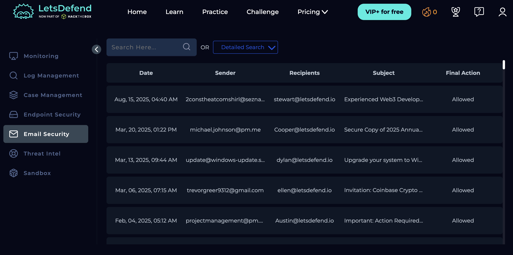
*LetsDefend Email Security dashboard showing all incoming emails with 
sender, recipient, subject, date, and final action (Allowed/Quarantined). 
This is the first screen a SOC analyst checks when investigating an 
email-based alert. Multiple suspicious emails are visible even before 
clicking into any of them — sender domains and subject lines alone 
reveal several red flags.*

---

### 2. Phishing Email — Microsoft Windows 11 Impersonation

#### 2a. Email header analysis
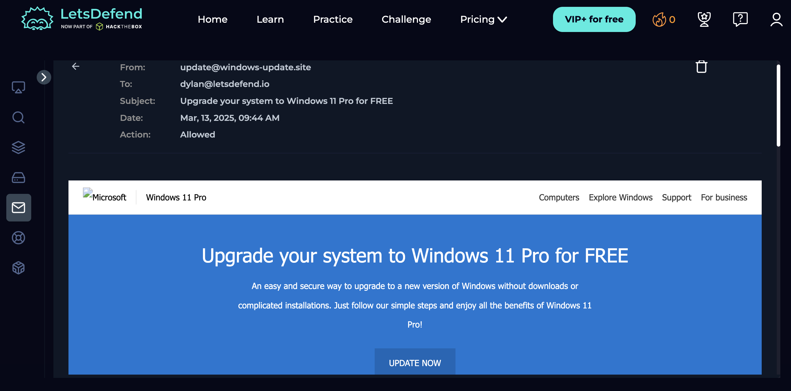

| Field | Value | Verdict |
|-------|-------|---------|
| From | update@windows-update.site | 🔴 NOT microsoft.com |
| To | dylan@letsdefend.io | Target identified |
| Subject | Upgrade your system to Windows 11 Pro for FREE | 🔴 Urgency + free offer lure |
| Date | Mar 13, 2025, 09:44 AM | — |
| Action | Allowed | ⚠️ Should have been blocked — false negative |

*The sender domain is windows-update.site — completely unrelated to 
Microsoft. This is a typosquatting/lookalike domain attack. Microsoft 
only sends emails from @microsoft.com domains. The word FREE in the 
subject is a manipulation tactic — legitimate software companies do 
not offer paid software upgrades as free email promotions.*

#### 2b. Countdown timer — urgency manipulation
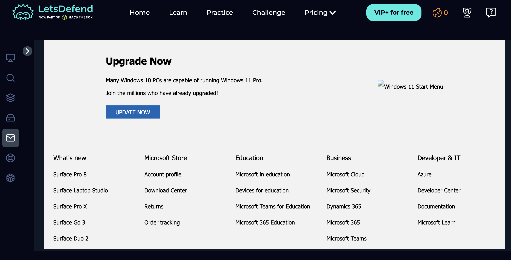
*"Before the action ends: 4 Days 23 Hours 59 Mins"*

*A countdown timer is a deliberate psychological manipulation technique 
designed to create urgency and panic. The goal is to force the victim 
to click before they have time to think critically or verify the email. 
This is a core social engineering principle — pressure reduces rational 
decision making. The URL visible at the bottom of the screen confirms 
the fake domain: https://www.windows-update.site*

*The email body copies Microsoft's exact visual design — logo, blue 
colour scheme, navigation bar, layout, and typography. This is brand 
impersonation. Multiple "UPDATE NOW" buttons are placed throughout 
the email to maximise the probability of a click.*

*Key red flags:*
- Copied Microsoft branding to appear legitimate at first glance
- Multiple CTA buttons creating repeated pressure to act
- No personalisation — addressed generically, not to a specific user
- Hosted on windows-update.site, not microsoft.com

#### 2d. Fake Microsoft footer
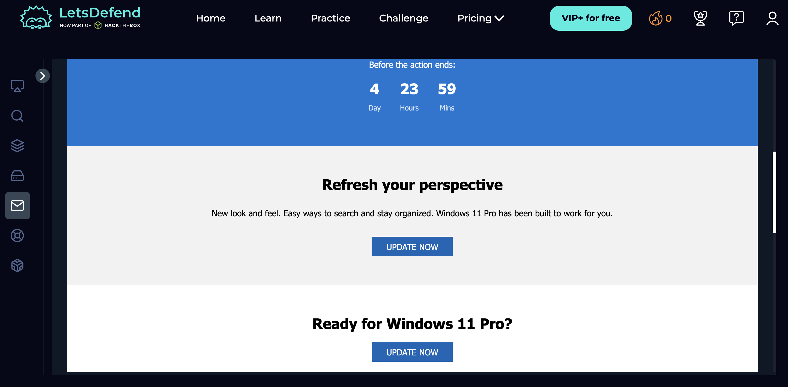
*The email footer replicates Microsoft's full website navigation 
including Surface products, Microsoft Store, Azure, Education, and 
Microsoft Learn sections. This level of detail indicates a 
sophisticated, pre-built phishing kit — not a one-off email.*

**Final Verdict: 🔴 PHISHING — High Confidence**

| Indicator | Detail |
|-----------|--------|
| Fake domain | windows-update.site ≠ microsoft.com |
| Urgency tactic | Countdown timer — 4 days 23 hours |
| Brand impersonation | Full Microsoft visual design copied |
| Free upgrade lure | "Windows 11 Pro for FREE" |
| Multiple CTAs | Repeated UPDATE NOW buttons |
| Filter failure | Action was Allowed — false negative |

*SOC response: Quarantine email from Dylan's inbox, block domain 
windows-update.site at email gateway, check if other employees 
received the same email, submit domain as IOC, notify Dylan directly.*

---

### 3. Spear Phishing — Fake Coinbase Hiring Assessment

#### 3a. Email header
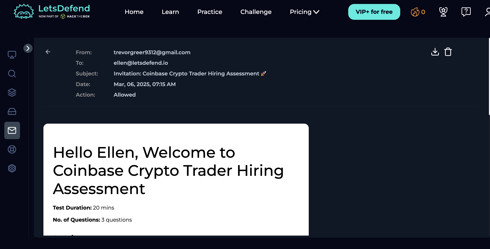

| Field | Value | Verdict |
|-------|-------|---------|
| From | trevorgreer9312@gmail.com | 🔴 Random Gmail — not coinbase.com |
| To | ellen@letsdefend.io | Specific target — spear phishing |
| Subject | Invitation: Coinbase Crypto Trader Hiring Assessment 🚀 | 🔴 Fake job offer lure |
| Date | Mar 06, 2025, 07:15 AM | — |
| Action | Allowed | ⚠️ False negative — reached inbox |

*Legitimate Coinbase communications always come from @coinbase.com 
domains. No real company ever sends hiring assessments from personal 
Gmail accounts. The random number suffix (9312) in the sender name is 
characteristic of auto-generated phishing accounts created in bulk.*

#### 3b. Fake assessment details

*The email presents a professional-looking "Coinbase Crypto Trader 
Hiring Assessment" with structured sections, test duration (20 minutes), 
and question count (3 questions). This level of detail is designed to 
make the victim believe they have been specifically selected for a real 
opportunity — increasing emotional investment and reducing suspicion.*

*This attack technique is called a job offer lure — one of the most 
effective phishing methods because the victim is motivated and 
emotionally engaged rather than suspicious.*

#### 3c. Fake job requirements

*The email includes detailed Key Requirements covering blockchain 
knowledge, trading expertise, risk management, and analytical skills — 
all professionally written to appear completely legitimate.*

*The Continue button at the bottom almost certainly leads to a 
credential harvesting page or malware download, not a real assessment.*

**Final Verdict: 🔴 PHISHING — High Confidence**

| Indicator | Detail |
|-----------|--------|
| Gmail sender | trevorgreer9312@gmail.com ≠ coinbase.com |
| Auto-generated account | Random number suffix in sender name |
| Unsolicited job offer | Ellen never applied to Coinbase |
| Credential harvest risk | Continue button leads to unknown destination |
| Detailed fake content | Sophisticated phishing kit |
| Filter failure | Allowed — reached Ellen's inbox |

---
### 4. Action Required Email — projectmanagement@pm.me
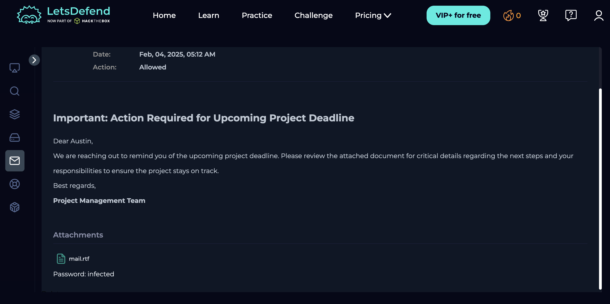

| Field | Value | Verdict |
|-------|-------|---------|
| From | projectmanagement@pm.me | 🔴 pm.me is not a business domain |
| To | Austin@letsdefend.io | Target identified |
| Subject | Important: Action Required... | 🔴 Classic urgency subject line |
| Date | Feb 04, 2025, 05:12 AM | 🔴 Sent at 5:12 AM — unusual hours |
| Action | Allowed | ⚠️ False negative — reached inbox |

*pm.me is a Proton Mail personal email domain — no legitimate business 
sends official action-required emails from a personal Proton Mail 
account. Combined with the 5:12 AM send time and urgency subject line, 
this email shows multiple red flags before even opening it.*

**Red flags:**

| Indicator | Detail |
|-----------|--------|
| Personal email domain | pm.me = Proton Mail personal account |
| Urgency subject | "Important: Action Required" creates panic |
| Sent at 5:12 AM | Outside normal business hours |
| Vague subject | No specifics — forces recipient to open to find out |
| Filter failure | Allowed — reached Austin's inbox |

**Why "Action Required" is so effective:**
The subject line gives no information about what action is needed — 
this deliberate vagueness forces the recipient to open the email to 
find out. Once opened, the body content delivers the actual social 
engineering. This is a calculated design choice by attackers to 
maximise open rates.

**Final Verdict: 🔴 SUSPICIOUS — High probability phishing**

*SOC response: Quarantine from Austin's inbox, check if Austin 
opened or clicked anything inside, block sender domain pm.me if 
confirmed malicious, check for other employees who received similar 
emails from pm.me addresses.*

### 5. Multiple Threats — Quarantined Email Campaign
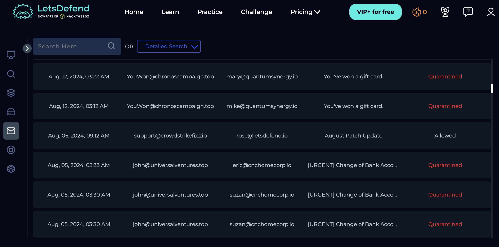
*Email list showing a mix of Allowed and Quarantined emails. The system 
correctly blocked several high-confidence phishing attempts:*

| Sender | Subject | Action | Threat Type |
|--------|---------|--------|-------------|
| YouWon@chronoscampaign.top | You've won a gift card | 🔴 Quarantined | Prize scam |
| YouWon@chronoscampaign.top | You've won a gift card | 🔴 Quarantined | Same campaign, multiple targets |
| support@crowdstrikefix.zip | August Patch Update | ⚠️ Allowed | CrowdStrike impersonation |
| john@universalventures.top | [URGENT] Change of Bank Acco... | 🔴 Quarantined | BEC — financial fraud |
| john@universalventures.top | [URGENT] Change of Bank Acco... | 🔴 Quarantined | Same BEC, multiple targets |

*Key observation: The CrowdStrike email was Allowed while clearly 
suspicious — this is exactly why automated filters alone are not 
sufficient. Human SOC analyst review is always required.*

---

### 6. CrowdStrike Impersonation — Critical False Negative
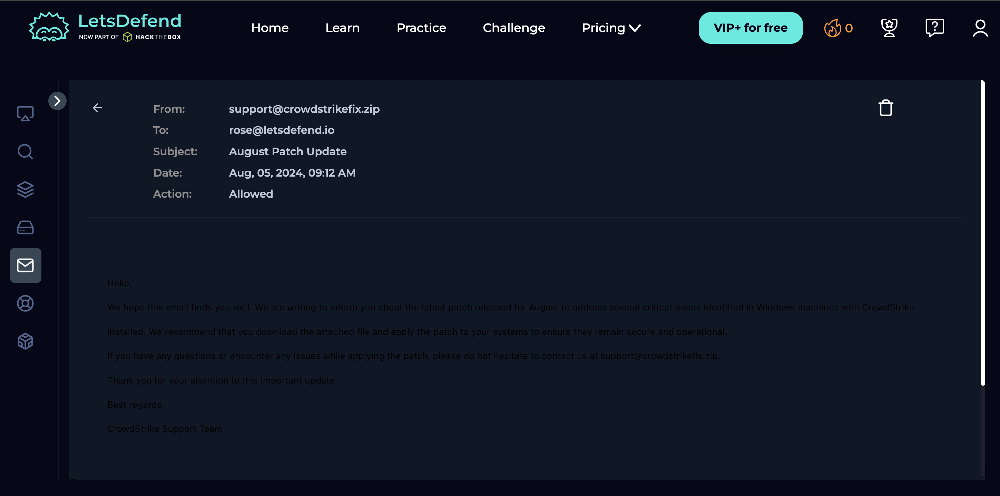

| Field | Value | Verdict |
|-------|-------|---------|
| From | support@crowdstrikefix.zip | 🔴 .zip is not a real email domain |
| To | rose@letsdefend.io | Target identified |
| Subject | August Patch Update | 🔴 Exploits patch urgency |
| Date | Aug 05, 2024, 09:12 AM | 🔴 Days after real CrowdStrike outage |
| Action | Allowed | 🔴 Critical false negative — reached inbox |

*This email was sent on August 5, 2024 — immediately after the 
catastrophic real CrowdStrike global outage on July 19, 2024. The 
attacker deliberately timed this campaign to exploit the massive 
confusion and urgency surrounding CrowdStrike patch communications. 
Employees actively expecting real patch updates would be highly likely 
to trust this email without questioning it.*

**Why this is the most dangerous email in this analysis:**
- Exploits a real-world event — employees are primed to expect this email
- .zip domain is unusual enough to bypass some filters
- No attachments or links visible — appears as plain text
- Social engineering based on fear and urgency, not technical trickery
- The filter failed — it reached the recipient's inbox

**Red flags a SOC analyst must catch:**

| Indicator | Detail |
|-----------|--------|
| .zip domain | crowdstrikefix.zip — .zip TLD not used by real companies |
| Domain mismatch | Real CrowdStrike emails come from @crowdstrike.com only |
| Attachment lure | "Download the attached file" — malware delivery attempt |
| Opportunistic timing | Sent during real CrowdStrike incident |
| Self-referencing | Asks to contact the same fake domain for support |
| CrowdStrike never emails patches | Official patches distributed through Falcon console only |

*SOC response: Immediately quarantine from rose's inbox, verify if 
attachment was opened or downloaded, isolate rose's endpoint if 
attachment was executed, block crowdstrikefix.zip at gateway, 
company-wide security alert, threat hunt for similar emails.*

---

### 7. Business Email Compromise (BEC) — Bank Fraud Attempt

#### 8a. Email header
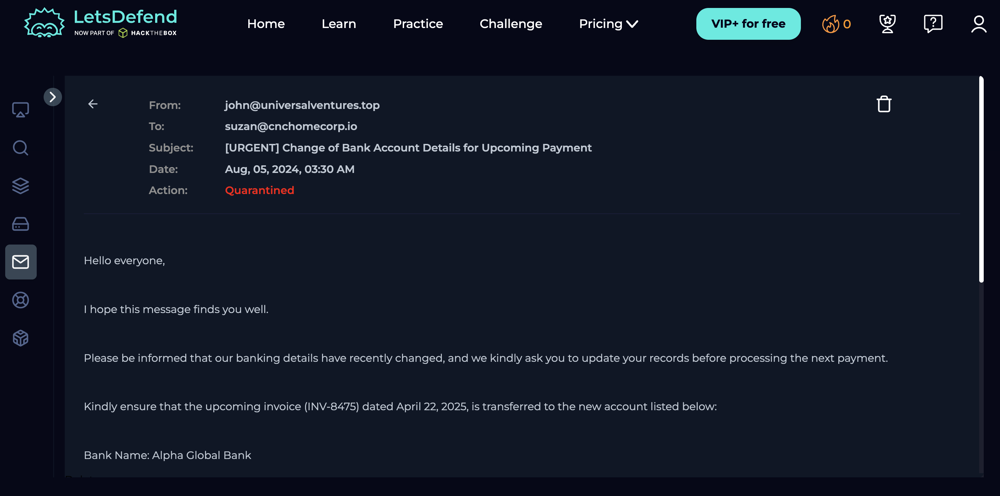

| Field | Value | Verdict |
|-------|-------|---------|
| From | john@universalventures.top | 🔴 .top domain — not legitimate |
| To | suzan@cnchomecorp.io | 🔴 Finance staff targeted |
| Subject | [URGENT] Change of Bank Account Details for Upcoming Payment | 🔴 Classic BEC subject line |
| Date | Aug 05, 2024, 03:30 AM | 🔴 Sent at 3:30 AM — outside business hours |
| Action | Quarantined | ✅ Correctly blocked |

#### 8b. Fraudulent bank details
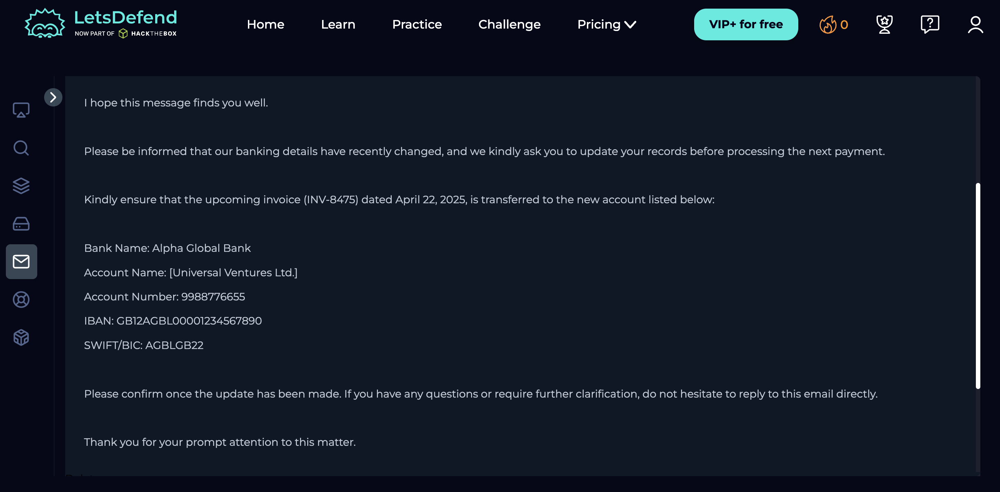
*The email provides complete fraudulent banking information:*
- Bank Name: Alpha Global Bank
- Account Number: 9988776655
- IBAN: GB12AGBL00001234567890
- SWIFT/BIC: AGBLGB22

*This is a textbook Business Email Compromise attack. The attacker 
provides complete, realistic-looking banking details to make the 
request appear routine and legitimate. A busy finance employee 
processing invoices might update payment details without verifying 
through a secondary channel — resulting in funds being transferred 
directly to the attacker's account.*

#### 8c. Fake executive identity
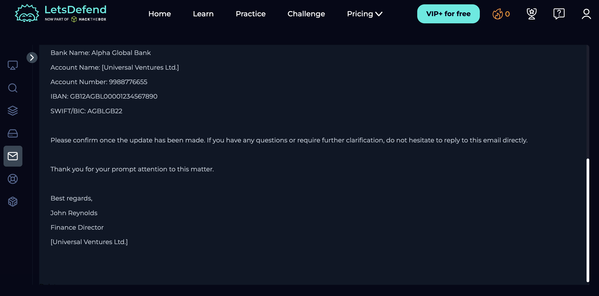
*The email is signed "John Reynolds, Finance Director, Universal 
Ventures Ltd." — impersonating a senior executive to add authority 
and legitimacy. BEC attackers always impersonate people in positions 
of authority (CFO, Finance Director, CEO) because employees are less 
likely to question requests from senior management.*

**Final Verdict: 🔴 BEC ATTACK — Quarantined correctly ✅**

| Indicator | Detail |
|-----------|--------|
| Fake domain | universalventures.top ≠ legitimate company |
| Sent at 3:30 AM | Outside normal business hours |
| [URGENT] pressure | Forces quick action without verification |
| Complete bank details | Ready-made fraud — just needs one payment |
| Executive impersonation | Finance Director adds false authority |
| Targets finance staff | BEC always targets payment processors |

**Why BEC is so financially devastating:**
BEC attacks caused over $2.9 billion in losses in 2023 alone (FBI 
IC3 Report). Unlike malware attacks, BEC emails contain no malicious 
links or attachments — just a convincing request. This makes them 
extremely difficult for automated systems to detect, which is why 
human analyst review of email security queues is critical in every SOC.

*SOC response: Confirm quarantine status, alert suzan not to process 
any payment changes, verify through phone call with actual vendor, 
block universalventures.top domain, submit bank account details as 
financial fraud IOCs, escalate to management and potentially law 
enforcement as BEC is a financial crime.*

---

## Summary of All Threats Investigated

| # | Email | Attack Type | Action Taken | Correctly Handled |
|---|-------|-------------|-------------|-------------------|
| 1 | windows-update.site | Phishing — brand impersonation | Allowed | ❌ False negative |
| 2 | trevorgreer9312@gmail.com | Spear phishing — job lure | Allowed | ❌ False negative |
| 3 | YouWon@chronoscampaign.top | Prize scam | Quarantined | ✅ Correct |
| 4 | support@crowdstrikefix.zip | Malware delivery — impersonation | Allowed | ❌ False negative |
| 5 | john@universalventures.top | BEC — financial fraud | Quarantined | ✅ Correct |

*3 out of 5 threats were handled correctly. 2 false negatives reached 
employee inboxes — demonstrating that automated email filters must 
always be supplemented by SOC analyst review.*

## Key Takeaways
- Sender domain is the single most important field to verify first
- Legitimate companies never use Gmail or .top/.zip domains for official email
- Urgency and pressure in subject lines is always a manipulation tactic
- BEC attacks have no malware — they rely entirely on social engineering
- False negatives (Allowed phishing emails) are more dangerous than 
  false positives because they reach the victim's inbox
- Automated filters alone are never sufficient — human review is essential
- Every phishing email that reaches an inbox requires immediate 
  quarantine, user notification, and a hunt for other affected users
