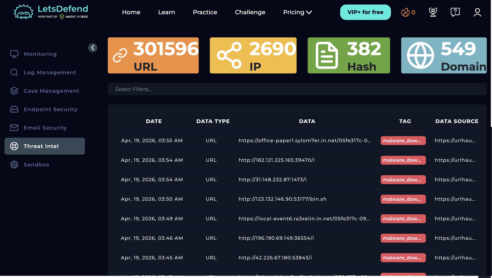
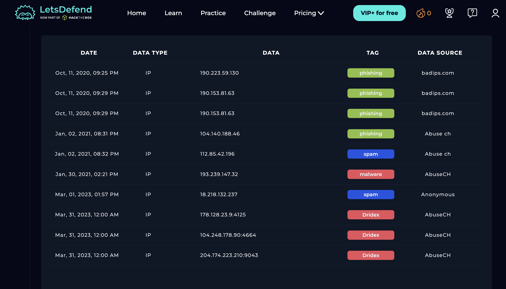
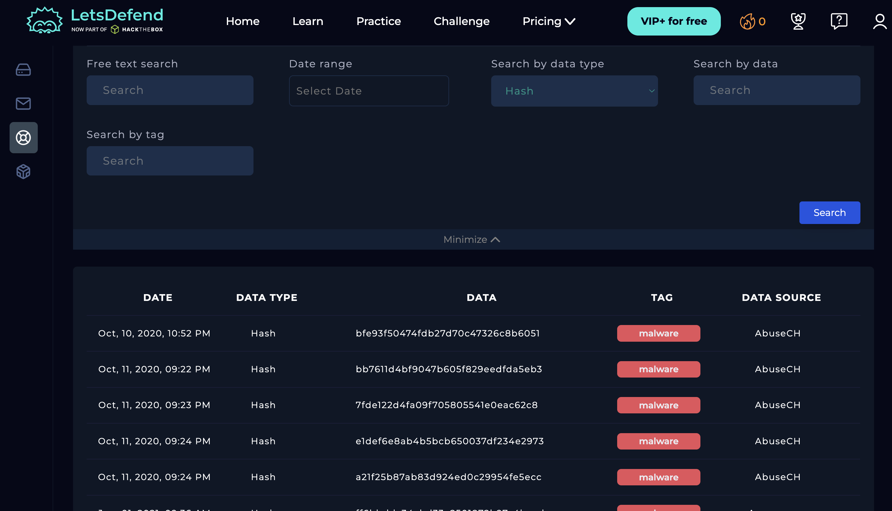
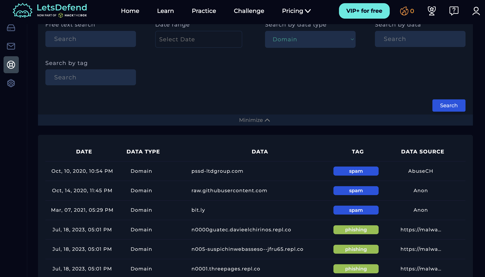
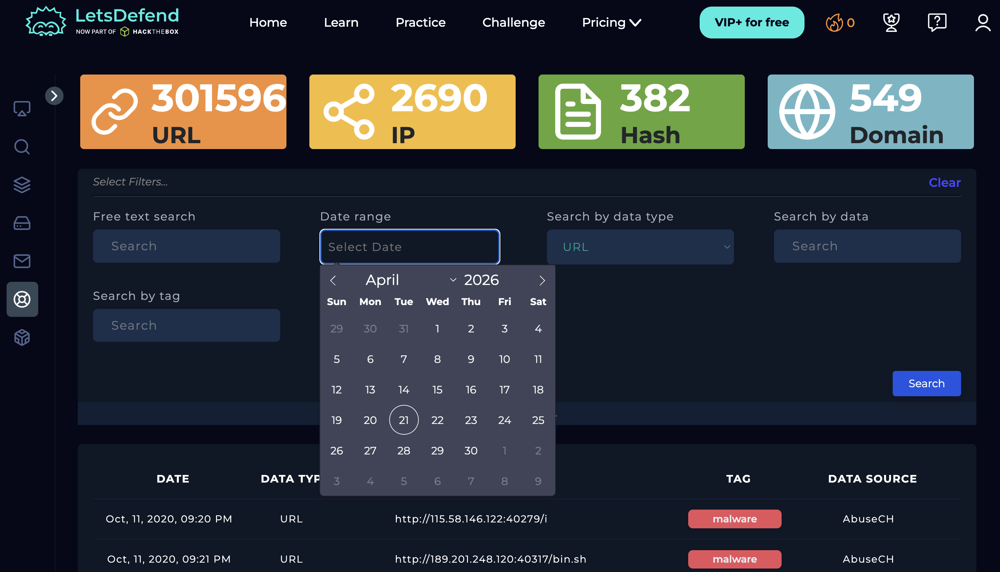
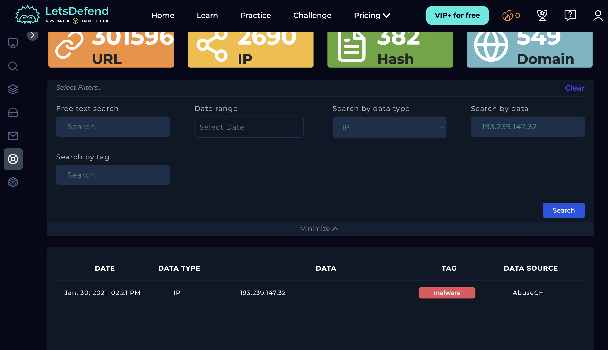
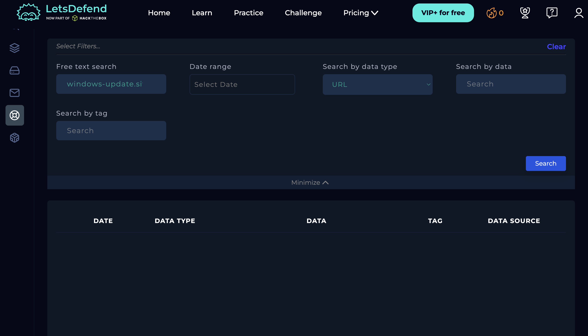

# Threat Intelligence
**Platform:** LetsDefend | **Date:** April 2026

## What is Threat Intelligence
Threat Intelligence (TI) is the collection, analysis, and application 
of information about current and potential cyber threats. In a SOC, 
threat intelligence is used to enrich alerts — taking a raw indicator 
like an IP address, domain, URL, or file hash and finding out if it 
is known to be malicious, what malware family it belongs to, who is 
behind it, and how serious the threat is.

Without threat intelligence, a SOC analyst would need to manually 
investigate every single indicator from scratch. With threat intel, 
a known malicious IP can be confirmed in seconds — saving hours of 
investigation time and allowing faster incident response.

## Types of Indicators of Compromise (IOCs)
| IOC Type | What it is | Example |
|----------|-----------|---------|
| URL | Full malicious web address | http://182.121.225.165:39470/i |
| IP Address | Malicious server IP | 193.239.147.32 |
| Hash | Unique fingerprint of a malicious file | MD5 or SHA256 of malware |
| Domain | Malicious domain name | windows-update.site |

## Threat Intel Sources Used in LetsDefend
| Source | What they track |
|--------|----------------|
| AbuseCH | Malware C2 servers, Dridex, ransomware infrastructure |
| URLhaus | Malware distribution URLs updated in real time |
| badips.com | Community-reported malicious IPs |
| Anonymous | Crowdsourced community threat submissions |

---

## Investigation Screenshots

### 1. Threat Intel dashboard — IOC overview

*The Threat Intel dashboard showing total IOC counts across all 
four categories:*

| IOC Type | Count | What this means |
|----------|-------|----------------|
| URL | 301,596 | Known malicious URLs tracked in real time |
| IP | 2,690 | Known malicious IP addresses |
| Hash | 382 | Known malicious file hashes |
| Domain | 549 | Known malicious domains |

*URLs have the highest count at 301,596 because malicious URLs are 
the most common IOC type — attackers constantly create new URLs for 
malware delivery and phishing, making URL tracking the most active 
area of threat intelligence.*

*All entries visible in the list are tagged malware_download and 
sourced from URLhaus — a real-time feed tracking malware distribution 
URLs. Malicious URLs visible include:*

| URL | Tag | Significance |
|-----|-----|-------------|
| https://office-paper1.sylom7er.in.net/... | malware_download | Subdomain-based malware delivery |
| http://182.121.225.165:39470/i | malware_download | Direct IP-based C2 — no domain needed |
| http://31.148.232.87:1473/i | malware_download | Non-standard port — evading detection |
| http://123.132.146.90:53177/bin.sh | malware_download | Linux shell script delivery |
| http://196.190.69.149:36554/i | malware_download | Direct IP C2 server |
| http://42.226.67.180:35843/i | malware_download | Direct IP C2 server |

*Note on bin.sh URLs: URLs ending in /bin.sh deliver Linux shell 
scripts — this indicates malware targeting Linux servers and cloud 
infrastructure, not just Windows endpoints. This is a growing attack 
vector as more organisations move to cloud.*

---

### 2. IP Intelligence list — malicious IP addresses

*List of known malicious IP addresses sourced from multiple threat 
intel feeds, showing different threat categories:*

| IP Address | Tag | Source | Threat Detail |
|------------|-----|--------|---------------|
| 190.223.59.130 | 🟢 phishing | badips.com | Active phishing server |
| 190.153.81.63 | 🟢 phishing | badips.com | Active phishing server |
| 104.140.188.46 | 🟢 phishing | Abuse.ch | Active phishing server |
| 112.85.42.196 | 🔵 spam | Abuse.ch | Spam campaign infrastructure |
| 193.239.147.32 | 🔴 malware | AbuseCH | Active malware C2 server |
| 18.218.132.237 | 🔵 spam | Anonymous | Spam server |
| 178.128.23.9:4125 | 🔴 Dridex | AbuseCH | Dridex banking trojan C2 |
| 104.248.178.90:4664 | 🔴 Dridex | AbuseCH | Dridex banking trojan C2 |
| 204.174.223.210:9043 | 🔴 Dridex | AbuseCH | Dridex banking trojan C2 |

**What is Dridex?**
Dridex is one of the most destructive banking trojans ever created. 
It infects Windows machines through malicious email attachments, 
then silently steals online banking credentials, intercepts 
transactions, and transfers funds to attacker-controlled accounts. 
The three Dridex C2 IPs visible here (178.128.23.9, 104.248.178.90, 
204.174.223.210) are servers that infected machines call home to — 
receiving instructions and sending stolen data.

*SOC action: If any endpoint alert shows outbound traffic to these 
IPs, it is immediately a confirmed Dridex infection. Isolate the 
endpoint, reset all banking credentials used on that machine, notify 
the user and management, escalate to incident response.*

**Multiple threat intel sources = higher confidence**
When the same IP appears in multiple threat intel sources, confidence 
in the verdict increases. A single source could be a false positive — 
multiple independent sources confirming the same IP is near-certain 
evidence of malicious activity.

---

### 3. Hash Intelligence list — malicious file fingerprints

*List of 382 known malicious file hashes. A hash is a unique 
mathematical fingerprint of a file — even changing one byte of a 
file completely changes its hash. This makes hashes the most reliable 
IOC type for file-based malware detection.*

*How hashes are used in SOC investigations:*
1. Endpoint alert fires on a suspicious file
2. Analyst takes the file's MD5 or SHA256 hash
3. Searches it in the threat intel database
4. If it matches — file is confirmed malware, no further analysis needed
5. If no match — file may be new/unknown malware, submit to sandbox

*Hash matching is the fastest way to confirm whether a file is 
malicious. It takes seconds and provides a definitive answer.*

---

### 4. Domain Intelligence list — malicious domains

*List of 549 known malicious domains. This is directly relevant to 
email security investigations — when analysing a phishing email, 
searching the sender domain here instantly confirms if it has been 
reported before.*

*Domains are used by attackers for:*
- Phishing sites impersonating legitimate brands
- Malware command and control infrastructure
- Malware distribution hosting
- Credential harvesting pages

*Connection to Email Security analysis: The domain windows-update.site 
from the Microsoft phishing email investigated earlier would appear 
in a database like this if it had been previously reported — allowing 
instant confirmation without manual investigation.*

---

### 5. Filter and search options

*The filter panel shows four search capabilities:*

| Filter | Purpose |
|--------|---------|
| Free text search | Search any keyword across all IOCs |
| Date range | Filter IOCs added within a specific time period |
| Search by data type | Filter by URL, IP, Hash, or Domain |
| Search by tag | Filter by threat category — phishing, malware, Dridex, spam |

*Real SOC investigation workflows using these filters:*

**Workflow 1 — Investigating a suspicious IP from an alert**
1. Search by data type → select IP
2. Paste the IP address in Search by data field
3. Click Search
4. Result: confirmed malicious with tag and source, or no result 
   meaning the IP is not yet in the database

**Workflow 2 — Hunting for phishing infrastructure**
1. Search by tag → type phishing
2. Set date range to last 7 days
3. Click Search
4. Result: all recently reported phishing IPs and domains — useful 
   for proactive threat hunting

**Workflow 3 — Checking a file from an endpoint**
1. Search by data type → select Hash
2. Paste the MD5 or SHA256 hash
3. Click Search
4. Result: instant verdict — known malware family or not seen before

**Workflow 4 — Validating email sender domain**
1. Search by data type → select Domain
2. Type the sender domain e.g. windows-update.site
3. Click Search
4. Result: confirms if domain is already flagged as phishing

---

### 6. IP search — investigating a specific indicator

*Searching for a specific malicious IP — this demonstrates the 
exact workflow a SOC analyst follows during an active investigation.*

*When an alert shows an endpoint communicating with an unknown IP, 
the analyst does not immediately escalate — they first check it 
against threat intel. If the IP appears with a malware or Dridex 
tag from AbuseCH, the investigation is immediately confirmed as a 
true positive and can be escalated to incident response without 
spending further time on analysis.*

*A no-result search is also valuable — it means the IOC may be 
new or previously unreported. The analyst then proceeds to deeper 
investigation using tools like VirusTotal, AbuseIPDB, or Shodan.*

---

### 7. Domain search — validating a phishing domain

*Searching for a specific domain — connecting threat intel directly 
to email security analysis. If a phishing domain like windows-update.site 
appears in this database, it provides definitive third-party 
confirmation that the email was malicious.*

*This cross-referencing between Email Security and Threat Intel is 
a core SOC workflow — no investigation should stay within a single 
tool. Evidence from multiple sources builds a stronger case.*

---

## How Threat Intel Connects to Other SOC Domains

| SOC Area | How Threat Intel Helps |
|----------|----------------------|
| Log Management | Search suspicious IPs from logs against TI database |
| Email Security | Validate sender domains and URLs in emails |
| Endpoint Security | Check file hashes and outbound connection IPs |
| Case Management | Attach TI findings as evidence in cases |
| Sandbox | Compare sandbox-detected IOCs against TI database |

## MITRE ATT&CK Mapping
| Technique | ID | How Threat Intel Detects It |
|-----------|----|-----------------------------|
| Command and Control | T1071 | Malicious IPs tagged as malware/Dridex C2 |
| Ingress Tool Transfer | T1105 | Malware download URLs from URLhaus |
| Phishing | T1566 | Phishing-tagged IPs and domains |
| Drive-by Compromise | T1189 | Malicious URLs delivering exploits |

## Key Takeaways
- Threat intel turns a raw IOC into confirmed, actionable context 
  in seconds
- Always check IPs, domains, hashes, and URLs against TI before 
  concluding any investigation
- A match in the database instantly confirms malicious activity 
  and speeds up escalation
- No match does not mean safe — new IOCs are created every day 
  and may not yet be reported
- Multiple intel sources confirming the same IOC = very high 
  confidence verdict
- Dridex banking trojan C2 IPs are among the most critical to 
  detect — direct financial impact on victims
- Connecting findings across Email Security, Endpoint Security, 
  and Threat Intel builds a complete picture of an attack
