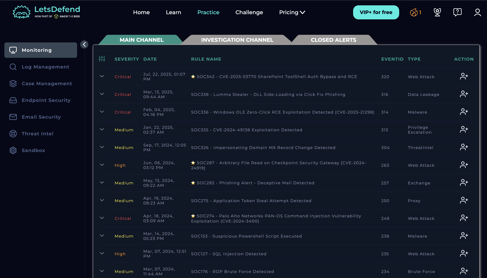

# SIEM Alert Monitoring - SOC Dashboard Analysis

## Overview
This analysis is based on a SOC dashboard from Let's Defend platform, where multiple security alerts are monitored and prioritized based on severity.

## Screenshot

---

## Observations

The dashboard shows multiple alerts categorized by severity:

### 🔴 Critical Alerts
- SharePoint ToolShell Auth Bypass and RCE (CVE-2025-53770)
- Lumma Stealer Malware Detection
- Windows OLE Zero-Click RCE Exploit

These require **immediate investigation**.

---

### 🟠 High Alerts
- Arbitrary File Read (CVE-2024-24919)
- SQL Injection Attack Detected

These indicate **active exploitation attempts**.

---

### 🟡 Medium Alerts
- Phishing Email Detection
- RDP Brute Force Attack
- Suspicious PowerShell Execution

These require **further analysis and correlation**.

---

## Key Analysis

### 1. Attack Types I Observed
- Web Attacks
- Malware
- Data Leakage
- Privilege Escalation
- Brute Force

---

### 2. Indicators of Compromise (IOCs)
- Suspicious IP addresses
- Malicious file behavior
- Abnormal login attempts

---

### 3. Patterns Identified
- Multiple authentication attacks (Brute Force, RDP)
- Web-based vulnerabilities (SQL Injection, RCE)
- Malware-related activities

---

## SOC Analyst Approach

If I were a SOC Analyst handling this dashboard:

### Step 1: Prioritize
- Focus on Critical alerts first

### Step 2: Investigate
- Check logs related to Event ID
- Analyze source IP
- Validate CVE details

### Step 3: Correlate
- Identify repeated attack patterns
- Link alerts to possible campaigns

### Step 4: Respond
- Block malicious IPs
- Isolate affected systems
- Escalate if needed

---

## Conclusion

This dashboard demonstrates real-world SOC monitoring where multiple threats are detected simultaneously. Proper prioritization and structured investigation are essential to prevent security incidents.

---

##  Skills I gained

- SIEM Monitoring
- Alert Prioritization
- Threat Analysis
- Incident Triage
